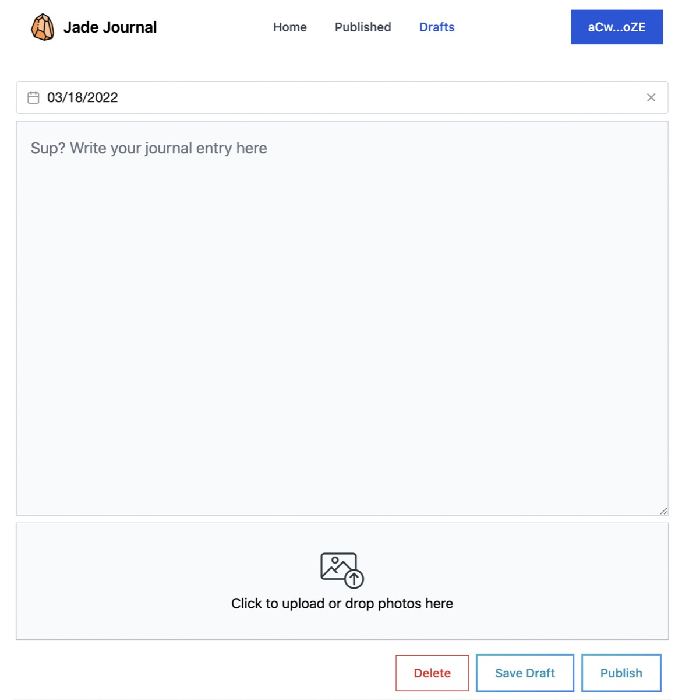

# Jade Web3 App

This is a web3 app for Jade Journal, to store the journals on blockchain, permanently.

👉🏻 Live app at https://jade2us.com/web3

👉🏻 Recorded demo at https://youtu.be/aUUVVcK9mUw

Live forever, our legacy.

 

 

## History of Jade

Jade was released as an iPhone app in 2015, when I became a parent. I built the [iPhone app](https://jade2us.com) such that my wife and I can collaborate to write collectively for our newborn. Then handover when the kids can write on their own.

However, I made a bad decision to use [Parse Platform](https://en.wikipedia.org/wiki/Parse,_Inc.) as the backend database. An awesome service, yet Parse was eventually ditched by Facebook in 2017, because it didn't serve the needs of a giant corporation..

It is a hard lesson.

Hopefully, a decentralized blockchain is much stronger for [Kate](https://just2me.com/2015/08/18/baby-kate-is-born/) & [Jade](https://just2me.com/2020/01/09/baby-jade-is-born/), and their children.

## Schema

Refer to [this](Schema.md) for all the different versions.